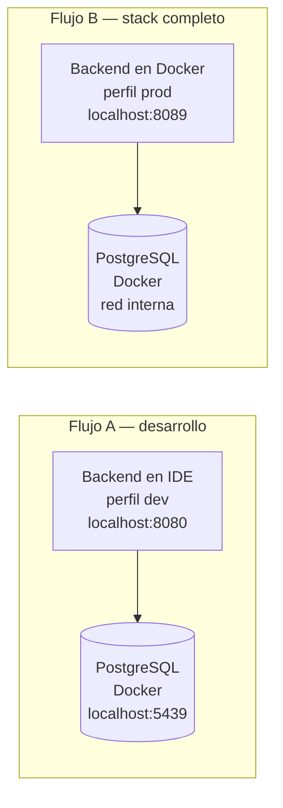

# Familia — Sistema de Gestión Familiar

[](https://www.oracle.com/java/technologies/javase/jdk21-downloads.html)
[](https://spring.io/projects/spring-boot)
[](https://angular.dev/)
[](https://www.postgresql.org/)
[](https://www.docker.com/)

Monorepo con el backend (API REST en Spring Boot) y el frontend (Angular) del
sistema de gestión de personas y ciudades. Este README es la guía para
**levantar y desplegar** el proyecto en tu máquina. Para el detalle de cómo
funciona internamente y el camino de la refactorización, ver
[`familia/ROADMAP.md`](familia/ROADMAP.md).

## Tabla de contenidos

- [Estructura del repositorio](#estructura-del-repositorio)
- [Requisitos previos](#requisitos-previos)
- [Configuración (.env)](#configuración-env)
- [Despliegue del backend](#despliegue-del-backend)
  - [Flujo A — Solo la base de datos (desarrollo)](#flujo-a--solo-la-base-de-datos-desarrollo)
  - [Flujo B — Base de datos + backend (stack completo)](#flujo-b--base-de-datos--backend-stack-completo)
- [Despliegue del frontend](#despliegue-del-frontend)
- [Puertos y URLs](#puertos-y-urls)
- [Verificación](#verificación)
- [Pruebas](#pruebas)
- [Licencia](#licencia)

## Estructura del repositorio

```
familia/                          ← raíz del monorepo (este README)
├── familia/                      ← BACKEND (Spring Boot) — aquí vive docker-compose.yml
│   ├── docker-compose.yml        ← orquesta db (+ backend con perfil `full`)
│   ├── Dockerfile                ← imagen del backend (build multi-etapa)
│   ├── .env.example              ← plantilla de variables de entorno
│   ├── pom.xml
│   ├── ROADMAP.md                ← bitácora de la refactorización
│   ├── db/sql/                   ← create_schema.sql + data.sql (init de PostgreSQL)
│   └── src/                      ← código y pruebas
├── familia-front/                ← FRONTEND (Angular 20)
│   └── src/
├── Familia.postman_collection.json
├── LICENSE
└── README.md
```

> **Importante:** todos los comandos de Docker del backend se ejecutan **desde
> la carpeta `familia/`** (el subdirectorio del backend), porque ahí está el
> `docker-compose.yml`. Los comandos del frontend se ejecutan desde
> `familia-front/`.

## Requisitos previos

| Herramienta | Versión | Para qué |
|---|---|---|
| Docker Desktop | 28+ | Levantar PostgreSQL (y opcionalmente el backend) |
| JDK | 21 | Compilar y correr el backend |
| Maven | 3.9+ (o el wrapper `./mvnw`) | Build del backend |
| Node.js | 20+ | Correr el frontend |
| Angular CLI | 20+ | Comando `ng serve` |
| IDE | IntelliJ IDEA / VS Code | Correr el backend en modo debug |

Verificación rápida:

```bash
docker --version
java -version
node --version
```

## Configuración (.env)

El backend lee sus variables desde un archivo `.env` (vía `dotenv-java`), que
**no se versiona**. Tanto el `docker-compose.yml` como la app al arrancar desde
el IDE necesitan que ese archivo exista en la carpeta `familia/`.

Copia la plantilla y completa los valores:

```bash
cd familia
cp .env.example .env
# completa al menos DB_USER y DB_PASSWORD
```

Variables disponibles:

| Variable | Ejemplo | Descripción |
|---|---|---|
| `APP_NAME` | `Familia` | Nombre de la aplicación |
| `APP_CONTEXT_PATH` | `/familia` | Context path de la API |
| `APP_PORT_IN` | `8080` | Puerto interno del backend (en el contenedor y en el IDE) |
| `APP_PORT_OUT` | `8089` | Puerto del backend expuesto al host por Docker |
| `DB_NAME` | `familia` | Nombre de la base de datos |
| `DB_HOST` | `localhost` | Host de la DB (`localhost` en dev; Docker inyecta `db` en el contenedor) |
| `DB_USER` | `<usuario>` | Usuario de PostgreSQL |
| `DB_PASSWORD` | `<contraseña>` | Contraseña de PostgreSQL |
| `DB_PORT_IN` | `5432` | Puerto interno de PostgreSQL (en el contenedor) |
| `DB_PORT_OUT` | `5439` | Puerto de PostgreSQL expuesto al host |

PostgreSQL se inicializa automáticamente la primera vez con
`db/sql/create_schema.sql` (esquema) y `db/sql/data.sql` (datos semilla).

### Dos "perfiles" que no hay que confundir

| Concepto | Quién lo lee | Decide |
|---|---|---|
| **Perfil de Spring** (`dev` / `prod`) | El backend al arrancar | A qué URL de DB conecta |
| **Perfil de Docker Compose** (`full`) | El comando `docker compose` | Qué contenedores arranca |

El perfil de Spring se cambia editando **una sola línea** en
`familia/src/main/resources/application.properties`:

```properties
spring.profiles.active = dev    # o 'prod'
```

En el stack completo de Docker no hace falta tocar ese archivo: el contenedor
del backend recibe `SPRING_PROFILES_ACTIVE=prod` como variable de entorno, que
tiene mayor precedencia.

## Despliegue del backend

Hay dos flujos soportados. Ambos se ejecutan **desde la carpeta `familia/`**.



### Flujo A — Solo la base de datos (desarrollo)

Es el flujo del día a día: Docker levanta **solo PostgreSQL** y el backend se
corre desde el IDE para poder debuggear con breakpoints. El servicio `app` está
marcado con `profiles: ["full"]`, así que un `up` simple **no** lo arranca.

```bash
cd familia

# 1. Levantar solo PostgreSQL (queda expuesto en localhost:5439).
docker compose up -d

# 2. Confirmar que solo está la DB.
docker compose ps        # debe aparecer únicamente el contenedor `base_de_datos`

# 3. Arrancar el backend desde el IDE (clase FamiliaApplication).
#    Toma el perfil `dev` por defecto y conecta a localhost:5439.
#    Queda escuchando en http://localhost:8080/familia

# 4. Apagar la DB al terminar.
docker compose down
```

### Flujo B — Base de datos + backend (stack completo)

Levanta **DB + backend** containerizados. Hay que pasar `--profile full` en
**todos** los comandos del ciclo para que Compose reconozca el servicio `app`.

```bash
cd familia

# Construir la imagen del backend y levantar todo (perfil Spring `prod`).
docker compose --profile full up --build

# En segundo plano:
docker compose --profile full up -d --build

# Ver logs:
docker compose --profile full logs -f

# Apagar (agrega -v para borrar también el volumen de datos):
docker compose --profile full down
```

En este flujo el backend queda expuesto en `http://localhost:8089/familia`.

## Despliegue del frontend

El frontend es una app Angular 20 que consume el backend en
`http://localhost:8089/familia` (configurado en
`familia-front/src/app/enviroments/global-component.ts`).

```bash
cd familia-front
npm install
ng serve
```

Queda disponible en `http://localhost:4200/`.

> **Para que el front funcione de extremo a extremo** necesita el backend
> respondiendo en `http://localhost:8089/familia`. Ese puerto es el que expone
> el **Flujo B** (stack completo). Si prefieres correr el backend desde el IDE
> (Flujo A), este escucha en `APP_PORT_IN` (`8080`); en ese caso ajusta
> `apiUrl` en `familia-front/src/app/enviroments/global-component.ts` a
> `http://localhost:8080/familia`, o alinea los puertos.

## Puertos y URLs

| Servicio | Flujo | URL / Puerto |
|---|---|---|
| Backend (IDE, perfil dev) | A | `http://localhost:8080/familia` |
| Backend (Docker, perfil prod) | B | `http://localhost:8089/familia` |
| PostgreSQL (host) | A y B | `localhost:5439` |
| Healthcheck (Actuator) | A / B | `.../familia/actuator/health` |
| Frontend | — | `http://localhost:4200/` |

## Verificación

```bash
# Salud del backend (ajusta el puerto al flujo: 8080 en IDE, 8089 en Docker).
curl http://localhost:8089/familia/actuator/health

# Listar ciudades (catálogo semilla).
curl http://localhost:8089/familia/ciudades

# Crear una persona (datos de ejemplo, contrato en camelCase).
curl -X POST http://localhost:8089/familia/personas \
  -H "Content-Type: application/json" \
  -d '{
        "numeroDocumento": "1234567890",
        "nombre": "Juan",
        "apellidos": "Pérez",
        "fechaNacimiento": "1990-05-20",
        "correoElectronico": "juan.perez@correo.com",
        "telefono": "3001234567",
        "ocupacion": "EMPLEADO",
        "idCiudad": 1
      }'
```

También puedes importar `Familia.postman_collection.json` en Postman para
probar la colección completa.

## Pruebas

Las pruebas del backend se ejecutan desde la carpeta `familia/`:

```bash
cd familia
./mvnw clean verify
```

Las pruebas de integración usan **Testcontainers** (PostgreSQL real en un
contenedor). Si Docker no está disponible en la máquina, esas pruebas se
**omiten** automáticamente y el resto sigue corriendo, así que el build no se
rompe. El detalle de la estrategia de pruebas está en
[`familia/ROADMAP.md`](familia/ROADMAP.md) (fase F7).

## Licencia

Este proyecto está licenciado bajo los términos del archivo [LICENSE](LICENSE).

---

**Última actualización:** 2026-06-02
